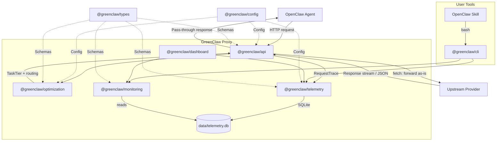

# GreenClaw — System Architecture

## Overview

GreenClaw is a transparent inference proxy that sits between OpenClaw and
upstream LLM providers. It reduces token costs by 60%+ through intelligent task
classification, context compaction, and model routing.

OpenClaw already supports multiple providers and handles provider-specific API
formats natively. GreenClaw does not re-implement any provider logic — it
intercepts requests, optimises them, and forwards them as-is to the upstream
provider.

## System Diagram



## Package Layer Rules

Packages are organized in strict layers within a pnpm workspace monorepo.
A package may only import from packages at the same level or below.

```
Layer 5 (top):  @greenclaw/dashboard
Layer 4:        @greenclaw/api, @greenclaw/cli
Layer 3:        @greenclaw/optimization, @greenclaw/monitoring
Layer 2:        @greenclaw/telemetry
Layer 1:        @greenclaw/config
Layer 0 (base): @greenclaw/types
```

This is enforced by `tests/architecture.test.ts` in CI.

## Request Lifecycle

1. **OpenClaw** sends a request to GreenClaw (any provider format — OpenAI,
   Anthropic, etc.)
2. **api/** receives the request and extracts the messages for analysis
3. **classifier/** analyzes the messages to determine a `TaskTier`:
   - `HEARTBEAT` — status checks, pings, cron patterns
   - `SIMPLE` — single tool calls, short factual questions
   - `MODERATE` — multi-step bounded tasks, email triage
   - `COMPLEX` — multi-agent coordination, open-ended generation
4. **compactor/** checks if the conversation context exceeds the token threshold;
   if so, it summarizes older turns while preserving the system prompt and recent
   messages
5. **router/** maps the `TaskTier` to the cheapest appropriate upstream model
   and swaps the model field in the request
6. **api/** forwards the modified request to the upstream provider via `fetch`
   and passes the response back to OpenClaw unchanged:
   - Streaming requests: SSE chunks are forwarded in real time
   - Non-streaming requests: the full JSON response is returned
   - A `RequestTrace` is emitted on every call (success or failure)

## Health Endpoint

`GET /health` returns:

```json
{
  "status": "ok",
  "version": "0.1.0",
  "uptime": 3600
}
```

## Telemetry

Every proxied request produces a `RequestTrace` containing:

- Timestamp, request ID
- Original model requested vs. actual model used
- Task tier classification
- Token counts (prompt, completion, total)
- Estimated cost (original vs. routed)
- Latency (classify, compact, route, upstream, total)
- Whether compaction was applied

## Usage Analytics

The `@greenclaw/monitoring` package provides user-facing usage analytics by
aggregating `request_traces` data. It offers:

- Usage summaries (daily/weekly/monthly tokens, cost, savings)
- Breakdowns by model, tier, or provider
- Time-series trends
- Budget alerting with threshold-based rules

The `@greenclaw/cli` package exposes these as the `greenclaw` CLI tool, and the
OpenClaw skill (`skill/greenclaw/SKILL.md`) wraps it for natural language access.
